# WoW Raid Telemetry Pipeline

**Proyecto de Curso:** Big Data e Inteligencia Artificial   
**Autor:** Byron V. Blatch Rodriguez   
**Profesor:** Francisco Javier Ortega   
**Repositorio:** [github.com/Vincent0675/raid-savior](https://github.com/Vincent0675/raid-savior)   
**Estado:** Fase 8 | Capa de serving APIs y visualización (ejecución manual validada)   
**Última actualización:** 23 de marzo de 2026.   

***

## 1. Visión general

Pipeline de telemetría **event-driven** que simula raids de World of Warcraft
sobre una arquitectura **Medallion** completa (Bronze → Silver → Gold) con
almacenamiento en MinIO (S3-compatible), validación estricta con Pydantic v2
y formato columnar Parquet en Silver/Gold.

## Pipeline actualizado

El flujo operativo actual de Fase 8 conecta la ingesta con serving vía Iceberg REST Catalog.

### Arquitectura por etapas

1. **Ingesta**: `scripts/api/receiver.py` valida eventos (`Pydantic`) y persiste batches en `bronze`.
2. **Bronze -> Silver**: `scripts/etl/run_bronze_to_silver.py` limpia y tipa eventos en Iceberg (`silver.raid_events`).
3. **Silver -> Gold**: jobs Spark generan tablas de negocio (`gold.*`) en Iceberg.
4. **Catalogo REST**: `iceberg-rest` expone metadata transaccional para Spark y PyIceberg.
5. **API de consumo**: FastAPI (`src/api/main.py`) consulta Iceberg via `IcebergService`.
6. **Visualizacion**: capa API lista; dashboards Grafana/Infinity y Superset quedan planificados.

```mermaid
flowchart LR
    A[Generador/Replayer] --> B[Flask Receiver\nPOST /events]
    B --> C[Bronze\nMinIO bucket bronze]
    C --> D[Bronze to Silver ETL]
    D --> E[Silver\nIceberg silver.raid_events]
    E --> F[Silver to Gold ETL Spark]
    F --> G[Gold\nIceberg gold.*]
    G --> H[Iceberg REST Catalog\nlocalhost:8181]
    H --> I[FastAPI Serving\nhealth, catalog, raids, metrics]
    I --> J[Grafana/Infinity o Superset\nplanificado]
```



### Requisitos previos y entorno

- Docker y Docker Compose instalados.
- Entorno conda/mamba `wow-telemetry` creado desde `environment.yml`.
- Dependencias del proyecto instaladas dentro del entorno.
- Ejecutar comandos Python/tests como `mamba run -n wow-telemetry <comando>`.

```bash
mamba env create -f environment.yml
mamba run -n wow-telemetry pip install -e .[dev]
docker compose -f infra/minio/docker-compose.yml up -d
```

### Procedimiento manual end-to-end (reproducible)

Ejecutar desde la raiz del repo (`/home/vincent/Refresh/raid-savior`).

1) **Levantar receptor HTTP (terminal 1)**

```bash
mamba run -n wow-telemetry python scripts/api/receiver.py
```

2) **Bootstrap del catalogo REST (terminal 2)**

```bash
mamba run -n wow-telemetry python scripts/bootstrap/register_tables_rest_catalog.py
```

3) **Verificar test suite API**

```bash
S3_ENDPOINT_URL=http://localhost:9000 \
S3_ACCESS_KEY=minio \
S3_SECRET_KEY=minio123 \
WAREHOUSE_BUCKET=warehouse \
ICEBERG_REST_URI=http://localhost:8181 \
mamba run -n wow-telemetry pytest tests/api -q
```

4) **Smoke de catalogo REST (integracion)**

```bash
S3_ENDPOINT_URL=http://localhost:9000 \
S3_ACCESS_KEY=minio \
S3_SECRET_KEY=minio123 \
WAREHOUSE_BUCKET=warehouse \
ICEBERG_REST_URI=http://localhost:8181 \
mamba run -n wow-telemetry pytest tests/integration/test_iceberg_rest_catalog_smoke.py -q
```

5) **Smoke de endpoints de negocio con catalogo real**

```bash
S3_ENDPOINT_URL=http://localhost:9000 \
S3_ACCESS_KEY=minio \
S3_SECRET_KEY=minio123 \
WAREHOUSE_BUCKET=warehouse \
ICEBERG_REST_URI=http://localhost:8181 \
mamba run -n wow-telemetry pytest tests/integration/test_api_business_endpoints_smoke.py -q
```

6) **Arrancar FastAPI y validar endpoints por curl**

```bash
S3_ENDPOINT_URL=http://localhost:9000 \
S3_ACCESS_KEY=minio \
S3_SECRET_KEY=minio123 \
WAREHOUSE_BUCKET=warehouse \
ICEBERG_REST_URI=http://localhost:8181 \
mamba run -n wow-telemetry uvicorn src.api.main:app --host 0.0.0.0 --port 8000
```

En otra terminal:

```bash
curl -sS http://localhost:8000/health
curl -sS http://localhost:8000/health/readiness
curl -sS http://localhost:8000/api/v1/catalog/namespaces
curl -sS http://localhost:8000/api/v1/catalog/tables
curl -sS "http://localhost:8000/raids?limit=2&offset=0"
curl -sS http://localhost:8000/metrics/global
curl -sS http://localhost:8000/raids/raid001
curl -sS http://localhost:8000/raids/raid001/players
curl -sS -i http://localhost:8000/raids/raid404
```

Evidencias reales de esta ejecucion: `docs/evidence/fase_8_evidencias.md`.

Estado final operativo (checklist Go/No-Go + comandos): `docs/fase_8_estado_final.md`.

**Resultados actuales del dataset de producción:**


### Volumen de datos procesados

| Capa | Bucket MinIO | Raids | Eventos | Formato |
|------|-------------|-------|---------|---------| 
| Bronze | `bronze` | 12 | ~600.000 | JSON (Hive-style) |
| Silver | `silver` | 12 | ~600.000 | Iceberg + Parquet + Snappy |
| Gold | `gold` | 12 | — | Iceberg + Parquet + Snappy |

### Tablas Gold generadas (modelo semidimensional)

| Tabla | Filas | Clave natural | Partición | Tipo | Descripción |
|-------|-------|---------------|-----------|------|-------------|
| `fact_raid_summary` | 12 | `raid_id` | `event_date` | Hecho | KPIs macro por raid |
| `fact_player_raid_stats` | ~3.744 | `(player_id, raid_id)` | `event_date` | Hecho | KPIs por jugador/raid |
| `dim_player` | 312 | `player_id` | `player_class` | Dimensión | Jugadores únicos, upsert ACID |
| `dim_raid` | 12 | `raid_id` | `event_date` | Dimensión | Raids únicos, upsert ACID |

### Stack tecnológico por fase

| Fase | Tecnología principal | Estado |
|------|---------------------|--------|
| 1 — Schema y generador | Pydantic v2 · NumPy | ✅ Completada |
| 2 — Ingesta HTTP | Flask · MinIO · Docker | ✅ Completada |
| 3 — ETL Bronze→Silver | Pandas · PyArrow · Parquet | ✅ Completada |
| 4 — ETL Silver→Gold (Pandas) | DuckDB · Pydantic v2 | ✅ Completada |
| 5 — ETL Silver→Gold (Spark) | PySpark 3.5 · S3A · MinIO | ✅ Completada |
| 6 — Orquestación | Dagster | ✅ Completada |
| 7 — Migración Silver/Gold a tablas ACID, MERGE INTO | Apache Iceberg | ✅ Completada |
| 8 — Serving APIs sobre Gold | FastAPI · Pydantic Settings · PyIceberg REST · Iceberg REST Catalog | ✅ Completada |

### Rendimiento Spark (entorno local)

| Métrica | Valor |
|---------|-------|
| Filas procesadas | 500.019 |
| Particiones RDD | 32 |
| Tiempo lectura Silver | ~6 s |
| Tiempo escritura Gold (4 tablas) | 22.4 s |
| Hardware | ASUS TUF A15 · RTX 3050 · Pop!\_OS |
| Coherencia Gold | ✅ 0 fallos |

### Time Travel Apache Iceberg

```
>>> Estado POST-corrección (tabla actual):
+-------+----------+----------+
|raid_id|boss_name |event_date|
+-------+----------+----------+
|raid001|Onyxia    |2026-02-25|
|raid002|Ragnaros  |2026-02-25|
|raid003|Nefarian  |2026-02-25|
|raid004|CThun     |2026-02-25|
|raid005|KelThuzad |2026-02-25|
|raid006|Illidan   |2026-02-25|
|raid007|Arthas    |2026-02-25|
|raid008|Archimonde|2026-02-25|
|raid009|Kiljaeden |2026-02-25|
|raid010|Deathwing |2026-02-25|
|raid666|Sargeras  |2026-03-05|
|raid999|The Jailer|2026-03-05|
+-------+----------+----------+


>>> Estado PRE-corrección (VERSION AS OF 5290609065853948740):
+-------+------------+----------+
|raid_id|boss_name   |event_date|
+-------+------------+----------+
|raid001|Unknown Boss|2026-02-25|
|raid002|Unknown Boss|2026-02-25|
|raid003|Unknown Boss|2026-02-25|
|raid004|Unknown Boss|2026-02-25|
|raid005|Unknown Boss|2026-02-25|
|raid006|Unknown Boss|2026-02-25|
|raid007|Unknown Boss|2026-02-25|
|raid008|Unknown Boss|2026-02-25|
|raid009|Unknown Boss|2026-02-25|
|raid010|Unknown Boss|2026-02-25|
|raid666|Unknown Boss|2026-03-05|
|raid999|Unknown Boss|2026-03-05|
+-------+------------+----------+


>>> HISTORIAL DE SNAPSHOTS — wow.gold.dim_raid
+-------------------+-----------------------+---------+
|snapshot_id        |committed_at           |operation|
+-------------------+-----------------------+---------+
|5290609065853948740|2026-03-12 17:36:33.781|append   |
|4677864922372387292|2026-03-18 12:18:18.982|overwrite|
+-------------------+-----------------------+---------+
```

***

## 2. Integración académica por asignatura

El proyecto sirve como **núcleo común** para las cuatro asignaturas de la especialización, usando la arquitectura Medallion como hilo conductor.

### 2.1 Big Data Aplicado (BDA)

En esta asignatura demuestro dominio de:

- **Arquitectura Medallion completa** sobre object storage (MinIO): diseño y operación de las capas Bronze, Silver y Gold con contratos de escritura claros y particionamiento lógico por `raid_id` y `event_date`.  
- **Formatos columnar y optimización de coste**: migración de JSON a Parquet + Snappy en Silver/Gold, explicando ratios de compresión, predicate pushdown y ventajas frente a almacenamiento row-based.   
- **Modelado de tablas semidimensionales en Gold**: diseño de `dim_player`, `dim_raid` y facts (`fact_raid_summary`, `fact_player_raid_stats`) como base de analítica y ML. 

### 2.2 Sistemas de Big Data

En Sistemas de Big Data el foco está en la **operacionalización** del pipeline:

- **Ingesta event-driven y observabilidad**: receptor HTTP Flask, logs detallados por batch, métricas de throughput y latencia de ingesta, y scripts de inspección (`inspect_bronze_vs_silver`, `inspect_gold`).   
- **Infraestructura contenedorizada**: despliegue de MinIO y servicios auxiliares con Docker Compose, siguiendo patrones de data lake sobre object storage.   
- **Preparación para orquestación**: diseño del pipeline Bronze→Silver→Gold como DAG lógico listo para ser portado a Dagster/Airflow en las fases siguientes (Fase F).   

### 2.3 Programación de Inteligencia Artificial

Aquí el proyecto se usa como **backend de datos para APIs y dashboards**:

- **APIs de servicio sobre Gold** (implementadas en Fase 8): FastAPI expone endpoints para métricas de `fact_raid_summary` y `fact_player_raid_stats` con readiness real contra REST Catalog.   
- **Dashboards ligeros** (planificados): integración con Grafana/Infinity o Superset para explorar rendimiento por raid/jugador y validar visualmente las métricas generadas en Gold.   
- **Preparación de datasets de entrenamiento**: extracción de features limpias y agregadas desde Gold para consumo directo por librerías de AutoML como PyCaret.   

### 2.4 Modelos de Inteligencia Artificial

En Modelos de IA la Capa Gold es la **fuente única de verdad**:

- **Clasificación de raids**: uso de `fact_raid_summary` para predecir `raid_outcome` (Success/Wipe) en base a KPIs agregados de daño, curación, muertes y tiempo.   
- **Clustering de estilos de juego**: aplicación de algoritmos no supervisados sobre `fact_player_raid_stats` para extraer perfiles de jugadores (agresivo, consistente, glass cannon, etc.).    
- **Aprovechamiento de hardware GPU**: diseño del flujo para entrenar modelos pesados sobre Gold usando la RTX 3050 (CUDA) como acelerador.   

***

## 3. Arquitectura Medallion

```
Generador sintético
        │
        ▼
   [Bronze]  s3://bronze/wow_raid_events/v1/raid_id={id}/ingest_date={date}/batch_{n}.json
        │        JSON validado por Pydantic (schema-on-write)
        │
   run_bronze_to_silver.py
        │
        ▼
   [Silver]  s3://silver/wow_raid_events/v1/raid_id={id}/event_date={date}/part-{n}.parquet
        │        Parquet + Snappy — limpio, tipado, enriquecido
        │
   run_silver_to_gold.py --all
        │
        ▼
   [Gold]   s3://gold/
        ├── dim_player/player_id=all/
        ├── dim_raid/raid_id={id}/
        ├── fact_raid_summary/raid_id={id}/event_date={date}/
        └── fact_player_raid_stats/raid_id={id}/event_date={date}/
```

La arquitectura Medallion organiza los datos en tres capas de refinamiento progresivo que mejoran calidad, estructura y utilidad analítica.

### 3.1 Capa Bronze – Raw / Ingesta

**Responsabilidad:** almacenar datos crudos tal y como llegan desde el receptor HTTP, pero ya validados por schema-on-write.

- **Formato:** JSON (array de eventos validados).  
- **Destino:** bucket `bronze` en MinIO.  
- **Key pattern (contrato de escritura):**  
  `wow_raid_events/v1/raid_id={raid_id}/ingest_date={YYYY-MM-DD}/batch={uuid}.json`.  
- **Validación:**  
  - Pydantic v2 en el propio receptor (schema-on-write).  
  - Rechazo con HTTP 400 ante eventos inválidos, sin permitir su escritura en Bronze.  
- **Propiedades clave:**  
  - Inmutabilidad (append-only).  
  - Metadatos con `batch-id`, `event-count`, `ingest-timestamp` y `batch-source` para trazabilidad.

### 3.2 Capa Silver – Clean / Refinada

**Responsabilidad:** ofrecer eventos limpios, tipados y enriquecidos, listos para uso analítico masivo.

- **Formato:** Apache Parquet + compresión Snappy.  
- **Destino:** bucket `silver` en MinIO.  
- **Particionamiento lógico:**  
  `wow_raid_events/v1/raid_id={raid_id}/event_date={YYYY-MM-DD}/...`.  

**Transformaciones principales (módulo `SilverTransformer`):**

1. **Cast de tipos**  
   - `timestamp`, `ingest_timestamp`: string ISO 8601 → `datetime64[ns, UTC]`.  
   - Numéricos (`damage_amount`, `healing_amount`, health_pct, resources) → `float64`.  

2. **Deduplicación**  
   - Eliminación de duplicados por `event_id`.  
   - Conteo de duplicados eliminados en metadata.  

3. **Validación de rangos**  
   - `health_pct` en rango [0, 100].  
   - Daños y curaciones no negativos.  

4. **Enriquecimiento**  
   - `ingest_latency_ms`: diferencia temporal entre `timestamp` e `ingest_timestamp`.  
   - `is_massive_hit`: flag para golpes de daño mayor a un umbral (ej. 10.000).  
   - `event_date`: fecha derivada para particionamiento y reporting.  

### 3.3 Capa Gold con modelo semidimensional

La capa Gold sigue un diseño **semidimensional**: adopta conceptos de modelado dimensional (hechos y dimensiones) pero manteniendo cierta flexibilidad propia de un data lake.

#### 3.3.1 Estructura lógica de Gold

Gold está organizada en:

- **Dimensiones “pequeñas y estables”**:  
  - `dim_player`: información relativamente estática de cada jugador (rol, clase, nombre, etc.).  
  - `dim_raid`: metadatos de cada raid (boss, dificultad, fecha, duración esperada, etc.).   
- **Tablas de hechos particionadas**:  
  - `fact_raid_summary`: 1 fila por raid/encuentro, con métricas agregadas globales (daño total, healing total, muertes, duración real, `raid_outcome`, etc.).  
  - `fact_player_raid_stats`: 1 fila por jugador y raid, con DPS, HPS, ratio de críticos, share de daño, muertes, etc.   

Este enfoque es “semi” dimensional porque:

- Se respeta la idea de **hechos + dimensiones** de Kimball, pero  
- Se mantiene el almacenamiento en object storage particionado (MinIO + Parquet), sin un warehouse rígido, permitiendo lecturas directas desde motores analíticos (Pandas, DuckDB, PySpark).   

#### 3.3.2 Ventajas del diseño semidimensional

- **Lecturas analíticas eficientes**: las facts están particionadas por `raid_id` y `event_date`, y las dimensiones son pequeñas, lo que permite joins baratos incluso en un entorno de laptop.   
- **Preparación natural para BI y ML**: cualquier herramienta de BI o framework de ML puede consumir Gold casi “plug-and-play”, sin necesitar una capa intermedia de modelado adicional.   
- **Evolución controlada**: se pueden añadir nuevas métricas o atributos dimensionales siguiendo schema evolution de Parquet sin romper la compatibilidad con código existente.   

### 3.4 Subfase 7.4 — Dimensiones Gold (Apache Iceberg + MERGE INTO)

Las dos dimensiones del modelo semidimensional han sido migradas a tablas
**Apache Iceberg** con escritura **ACID** mediante `MERGE INTO` (upsert).

| Script | Tabla Iceberg | Grain | Columna inmutable | Partición |
|--------|--------------|-------|-------------------|-----------|
| `src/etl/gold_iceberg_dim_player.py` | `wow.gold.dim_player` | 1 fila / jugador | `first_seen_date` | `player_class` |
| `src/etl/gold_iceberg_dim_raid.py` | `wow.gold.dim_raid` | 1 fila / raid | `event_date` | `event_date` |

**Verificación de integridad (ejecución 12/03/2026):**

```
dim_player — Jugadores únicos : 312 | Diferencia Silver↔Gold : 0 | Snapshot : append
dim_raid   — Raids únicos     :  12 | Diferencia Silver↔Gold : 0 | Snapshot : append
```

**Decisiones de diseño:**
- `MERGE INTO` garantiza idempotencia: re-ejecuciones no duplican filas.
- Las columnas inmutables (`first_seen_date`, `event_date`) se excluyen del
  `UPDATE SET` para preservar el historial temporal del catálogo Iceberg.
- Particionado por `event_date` en `dim_raid` evita el antipatrón *small files*
  que generaría usar `raid_id` (UUID, alta cardinalidad) como partición en MinIO.
- `dim_raid` calcula `raid_size` directamente desde Silver con
  `countDistinct("source_player_id")`, eliminando la dependencia en
  `fact_raid_summary` y haciendo el script autocontenido.

***

## 4. Importancia de la validación en la ingesta Bronze

La validación estricta en Bronze es una **decisión de arquitectura central** del proyecto: se aplica un enfoque **schema-on-write** con Pydantic v2 directamente en el receptor HTTP, antes de guardar cualquier evento en MinIO.   

### 4.1 Por qué schema-on-write (y no solo schema-on-read)

Sin validación temprana:

- Bronze se llenaría de **basura estructural**: tipos inconsistentes (`damage` como string, timestamps en formatos distintos), campos faltantes o valores imposibles (daño negativo, `health_pct > 100`).   
- Los problemas aparecerían mucho más tarde, al intentar construir Silver/Gold, donde localizar el origen de los errores es muy costoso y rompe la trazabilidad.   

Con schema-on-write:

- Cada evento pasa por modelos Pydantic que verifican tipos, rangos y enums (por ejemplo, `event_type`, `player_role`, `damage_amount >= 0`, `timestamp` no en el futuro).   
- Los eventos inválidos se rechazan con un HTTP 400 y nunca llegan a Bronze, garantizando que **todo lo almacenado en Bronze ya es coherente a nivel de schema**.   

### 4.2 Beneficios para Silver, Gold y las asignaturas

- **Para BDA y Sistemas de Big Data**:  
  - Bronze actúa como registro inmutable pero ya “limpio de errores graves”, reduciendo la complejidad de Silver a limpieza lógica (duplicados, outliers) y no a arreglar basura estructural.   
- **Para Programación de IA y Modelos de IA**:  
  - Gold hereda esta calidad desde la base: los modelos de ML se entrenan con datos consistentes, evitando el clásico problema de “garbage in, garbage out” en proyectos académicos.     

En analogía electrónica, la validación en Bronze equivale a poner un **filtro y protección de entrada** en un sistema de adquisición de datos: no permites que una señal fuera de rango o con un formato imposible llegue al resto del circuito, protegiendo todos los componentes posteriores (Silver, Gold, ML, dashboards).   

***

## 5. Ejecutar el pipeline end-to-end

### Requisitos previos

#### 1. Crear el entorno de trabajo
```bash
mamba env create -f environment.yml
```
> Puede usarse también conda
```bash
conda env create -f environment.yml
```

#### 2. Activar el entorno
```bash
mamba activate wow-telemetry
```
#### 3. Instalar paquetes del proyecto

> Paquetes sin herramientas de desarrollo
```bash
pip install -e .
```

##### 3.1 Herramientas de desarrollador

> Paquetes con herramientas de desarrollo
```bash
pip install -e .[dev]
```
> Si descargas las herramientas de desarrollo
```bash
# Instalar los hooks de pre-commit
pre-commit install
```

#### 4. Descargar los JARS de Spark (SOLO UNA VEZ)
```bash
chmod +x scripts/download_spark_jars.sh
./scripts/download_spark_jars.sh
```

#### 5. Levantar MinIO
```bash
cd infra/minio && docker compose up -d
```
#### 6. Ingresar a http://localhost:9001/, introducir las credenciales (`minio` | `minio123` por predeterminado) y crear los Buckets "bronze", "silver" y "gold".

#### Resolución DNS de MinIO
Añade esta línea a `etc/hosts` (necesario solo en desarrollo local)

```bash
echo "127.0.0.1 minio" | sudo tee -a /etc/hosts
```

Esto permite que Spark y PyIceberg resuelvan el hostname minio

***

## 7. Ingesta Principal — Receptor HTTP en tiempo real

Para el flujo event-driven original (Flask + generador HTTP + SSE):

### Paso 0 — Levantar Flask y abrir cliente SSE

En una terminal aparte en raíz de proyecto
```bash
python scripts/api/receiver.py
```

> Abrir `tests/cliente_sse.html` en un navegador y abrir la consola JS donde se mostrarán los eventos.

### Paso 1 — Ingesta a Bronze

```bash
# Generador masivo
python scripts/generators/replay_raids.py \
  --num-raids 5 \
  --num-events-per-raid 50000 \
  --batch-size 500
```
#### Si vamos a la web UI de MinIO y nos dirigimos al Bucket "bronze" observaremos que los datos fueron ingestados correctamente.

### Paso 2 — ETL Bronze → Silver

```bash
python scripts/etl/run_bronze_to_silver.py
# Esperado: ✅ Exitosos: 1010 | 📊 Filas totales: 505.000
```


### Paso 3 — ETL Silver → Gold (batch automático)

```bash
# Procesa TODAS las particiones disponibles en Silver automáticamente
python scripts/etl/run_silver_to_gold.py --all

# Para re-procesar una partición concreta
python scripts/etl/run_silver_to_gold.py --raid-id raid001 --event-date 2026-02-25
```


### Paso 4 — Inspección y validación de Gold

```bash
# Vista consolidada de todas las particiones + coherencia
python scripts/analytics/inspect_gold.py --all

# Deep-dive en una partición concreta
python scripts/analytics/inspect_gold.py --raid-id raid001 --event-date 2026-02-25
```

### Paso 5 — Tests

```bash
python -m pytest
```

***

## 7. Estado del proyecto

### Fases completadas

| Fase | Descripción | Estado |
| :-- | :-- | :-- |
| **1** | Schema Pydantic v2 + Generador sintético NumPy | ✅ Completa |
| **2** | Receptor HTTP Flask + ingesta Bronze | ✅ Completa |
| **3** | ETL Bronze → Silver (Parquet, Snappy, particionado Hive) | ✅ Completa |
| **4** | Gold Medallion (dim_player, dim_raid, facts, validación) | ✅ Completa |
| **5** | ETL Silver→Gold (Spark)  | ✅ Completa |
| **6** | Orquestación mediante Dagster  | ✅ Completa |
| **7** | Table format | Apache Iceberg 1.x (catálogo Hadoop, MinIO) | ✅ Completa |
| **8** | Serving APIs (health/readiness/catalog/negocio) | FastAPI + PyIceberg REST + REST Catalog | ✅ Completa |


### Roadmap

| Fase | Descripción | Tecnología prevista |
| :-- | :-- | :-- |
| **8.1** | Visualización de la API | Grafana + Infinity plugin o Apache Superset |
| **9** | Modelado IA | MLflow + PyCaret + CuDF (RTX 3050) |
| **10** | Datos reales | Warcraft Logs API |


***

## 8. Deuda técnica documentada

| ID | Descripción | Severidad | Afecta |
| :-- | :-- | :-- | :-- |
| DT-01 | `MinIOStorageClient.list_objects()` no pagina (límite 1000 objetos) | Media | Silver con >1000 parquets por partición |
| DT-02 | Generador no produce eventos `player_death` en config actual | Baja | Métrica `total_deaths` siempre = 0 en Gold |
| ~~DT-03~~ | ~~`dim_player.total_raids` siempre = 1 (upsert incremental pendiente)~~ | ~~Baja~~ | ✅ Resuelto en Subfase 7.4 (MERGE INTO) |


***

## 9. Stack tecnológico

### Implementado

| Capa | Tecnología |
| :-- | :-- |
| Validación y schema | Pydantic v2, JSON Schema draft-07 |
| Generación sintética | NumPy (Normal, Bernoulli), UUID v4 |
| API e ingesta | Flask 3.x (receiver), FastAPI 0.135 (serving), python-dotenv |
| Configuración API | pydantic-settings (BaseSettings) |
| Object storage | MinIO (S3-compatible), boto3 |
| Procesamiento ETL | Pandas 2.x, PyArrow |
| Procesamiento distribuido | PySpark 3.5.8 (local) |
| Catálogo y table format | Apache Iceberg 1.x + Iceberg REST Catalog (`tabulario/iceberg-rest:0.11.0`) + PyIceberg 0.11 |
| Formato de almacenamiento | Apache Parquet + Snappy |
| Contenedores | Docker, Docker Compose |
| Entorno de ejecución | conda/mamba (`wow-telemetry`) |
| Testing | pytest |

### Planificado (Fases 8–10)

| Capa | Tecnología |
| :-- | :-- |
| Visualización | Grafana + Infinity plugin, Apache Superset |
| Consulta SQL in-process en serving | DuckDB (si se habilita en la API) |
| ML tracking | MLflow, PyCaret |
| GPU computing | CuDF (RAPIDS), CUDA 12.x |


***

**Hardware de desarrollo:**
ASUS TUF Gaming A15 · RTX 3050 4GB (CUDA) · Pop!_OS 22.04 · 16 GB RAM
